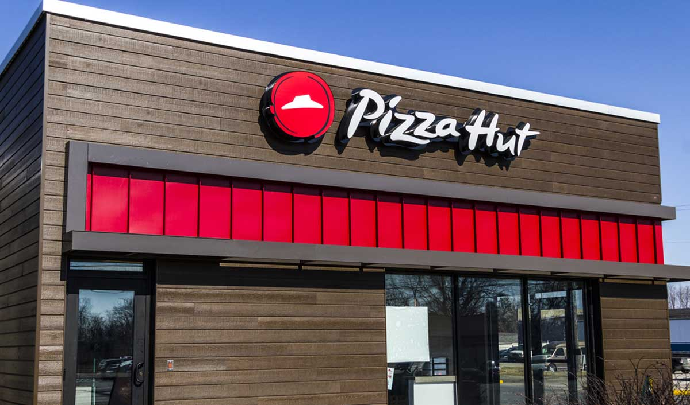
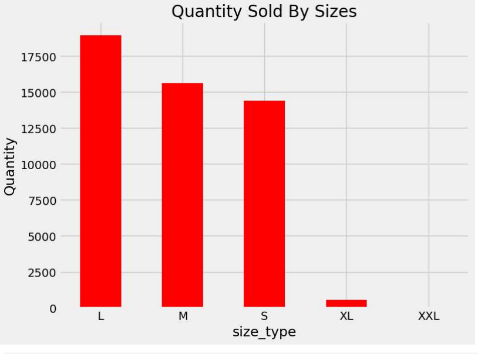
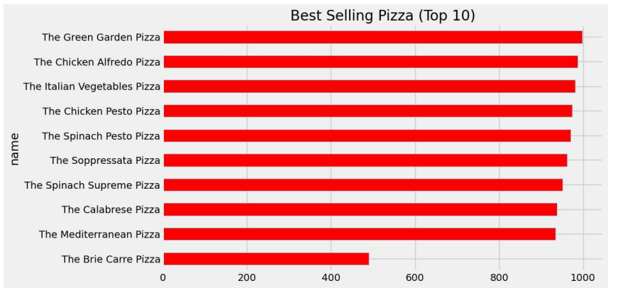
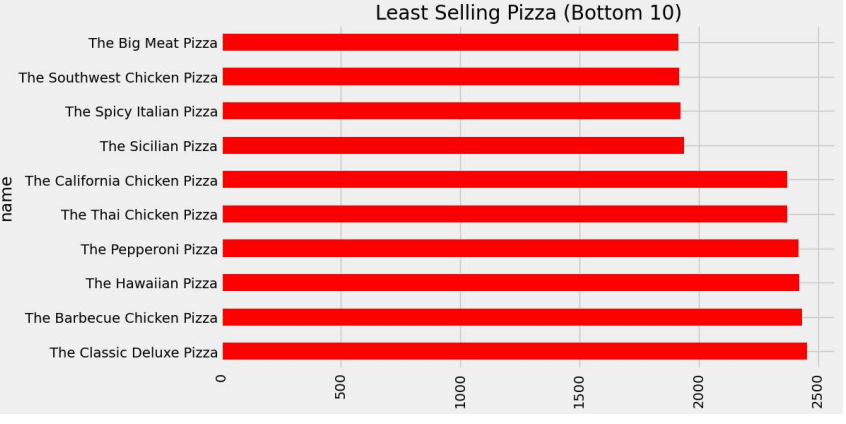
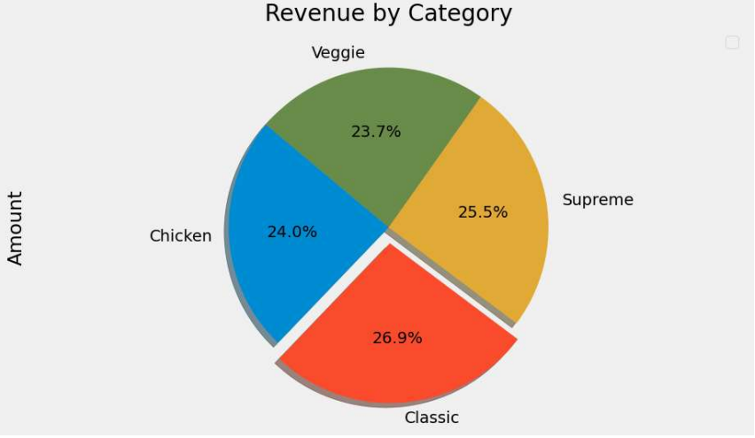
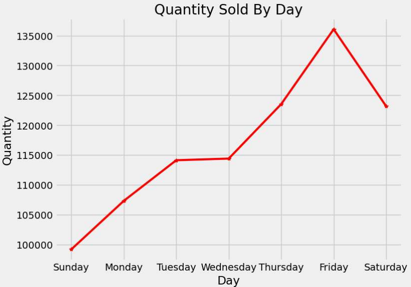
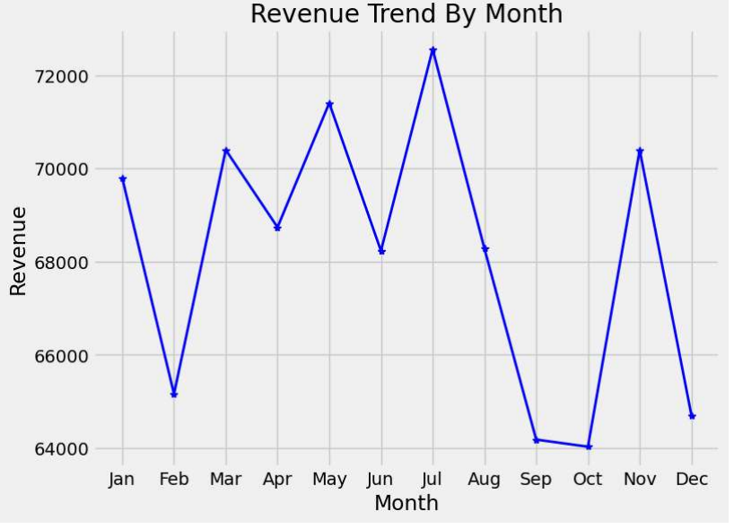

# PIZZA HUT
# 2015 PIZZA HUT SALES ANALYSIS USING PYTHON

# Introduction:

Pizza Hut (fictitious) is a newly established fast food retail outlet that is famous for its varieties
of finger licking and mouth watering Pizza in United States of America (USA) .
It is widely acknowledged that P-Hurt is the place to be for fun seekers and lovers of yummy and delicious Pizza.
They are pulling trees in the fast food buiness despite been a new entrant.
Pizza Hut has set a new standard and completely change the landscape of fast food business that has taken their competitors by surprise.

# Problem Statement:

In their efforts to maximise growth and sustain the momentum they have gained in the fast food business,
Pizza Hut wants to review their strategies,tactics and operations after a year in the business.
Also to aid their decsion in embarking on a nationwide spread of their franchise.
For a start, they have identified a couple of numbers they will like to report from their Data.
Pizza Hut is looking to use **PYTHON** as analytical tool for their report. 

# DataSet:
The DataSet is an Excel file with four sheets namely **orders**, **order_detail**, **pizza** and **pizza_types**, provided by Quantum Analytics.

# Skills Demonstrated:
While the Datasets requires less Cleaning,the major skill is exhibited is using the Python in-built libraries such as Pandas,Numpy,Matplotlib
to transform and create visuals.

# Data Transformation/Modelling:
The Pandas library was used to read the Excel file and also its merge method was used to merge the different sheets base on common column
to form a consolidated DataFrame called Pizza.Additional columns such as 'Amount','name_of_day',name_of_month' using the datetime module.
Matplotlib library was then used to create all the visuals needed.

 
 
 #  Analysis and Visualization:
 
## 1. Total  Revenue

## 2. Number of Pizza Category

## 3. Quantity of Pizza Sold

## 4. Total Order Processed

## 5. Quantity Sold By Sizes

## 6. Best Selling Pizza Top(10)

## 7. Least Selling Pizza Bottom(10)

## 8. Revenue By Category

## 9. Quantity Sold by Day

## 10. Revenue Trend By Month

# Report

The Total  Revenue generated within the period is **$817,860.05** with the **Classic variety** contributing **26.9%**
of the revenue closely followed by **Supreme** with **25.5%**.Pizza Hut has four(4) different Categories on their menu.
**49,574** quantity of different Pizza were sold,(with the 'L' size topping the chart} which translate to **48,620 orders**.
**'The Green Garden'** is the toast of Customer while **'The Big Meat'** is the least performing.
**Fridays** happens to be the busiest of days while the Month of **July** is the month in which the highest revenue was recorded.

The full Report of the Analysis is a Click away on the Read me file as PDF:

# Conclusion/Recommendation:
The management should ensure that adequate personnel are available on Fridays to process Customers orders and discourage employees
going off-duty on Fridays with incentives.

Also there is need to understand their Customers diet and decide whether to continue offering 'The Big Meat' Pizza.

There is the need to critically investigate Revenue trend between the month of July(Peak) to October(Slump) to understand the 
root cause of the trend.Likewise November to December.
